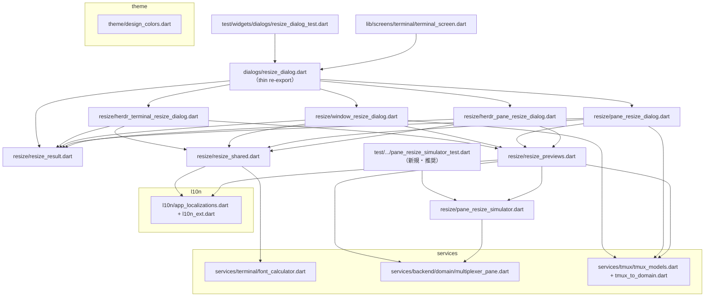

# P2 設計 v2: `lib/widgets/dialogs/resize_dialog.dart`（HEAD 1254行）責務ベース再設計

- 担当: rdialog-designer（タスク#24）
- 対象: `lib/widgets/dialogs/resize_dialog.dart`（HEAD 1254 行）
- 制約: **設計のみ・コード変更禁止**。本ファイルは `/tmp/p2-design/rdialog.md`（リポジトリ外）
- 原則: ①1ファイル=1責務 ②合成優先（mixin/基底/part 禁止）③公開API変更は許容（呼出元・テスト更新含む）④依存非循環 ⑤各ファイル500行未満 ⑥挙動不変（テスト期待値不変）
- **v2 改訂**（design-critic レビュー /tmp/p2-design/critique.md §2 + リーダー方針反映）

---

## 0. v1 → v2 変更点サマリ

| # | 変更 | 根拠 |
|---|---|---|
| 1 | **`resize_dialog.dart` は削除せず thin re-export として存続**（export のみ・doc で実装先明記）。`resize_dialogs.dart` 新設は取りやめ | リーダー方針（全P2共通・確定）: 既存公開エントリポイントを残し**呼出元・テストの import 変更ゼロ** |
| 2 | **14ファイル案 → 9ファイル案**（新規実装 8 + thin re-export 1）。単一用途の小部品 WarningBox/PresetChips/SizeInputRow/SizePreset は `resize_shared.dart` へ統合、プレビュー3種は `resize_previews.dart` へ統合 | critique §2.3【中】過剰分割の見直し（目安 8前後） |
| 3 | **共通スクフォールド `ResizeDialogScaffold` を新設**（AlertDialog 骨格 + 入力行 + チップ + actions を吸収）。`_presets` getter 4重複も `SizePreset.standardSet` ファクトリで解消 | critique §2.3【中】骨格コピペの解消（挙動不変の範囲で） |
| 4 | テスト件数 9→**10**（実測: `testWidgets(` 10件） | critique §2.1【軽微】 |
| 5 | `_SizePreset` 行数 1→**7**（L183-189: doc 1行 + 定義 6行。critique の 5行 は定義のみ・183-187 と数える場合もあり） | critique §2.2【軽微】 |
| 6 | `HerdrLayoutPreview` に **min-1 clamp（cols<1→1 / rows<1→1）と最小サイズガード（sidebar≥24px・tabRow≥12px）の維持**を明記 | critique §2.4【中】 |
| 7 | `PaneGridPreview` ほか resize 内部部品の公開面: **`@internal` 化を採用**（同一パッケージ内からは警告なしで使用可・テストも可） | critique §2.5【軽微】 |
| 8 | `_presets` getter 重複の実測を **4 箇所**（L89/232/374/523）と修正（critique 記載の 3 箇所は誤り・HerdrResizeTerminalDialog の L523 が欠落） | 実測（rg で確認） |

---

## 1. 現状責務分析（事実・HEAD 検証済み）

### 1.1 ファイル構成と責務の混在状況

| 範囲 | シンボル | 責務 | 行数 |
|---|---|---|---|
| 15-34 | `ResizeResult`（公開） | リサイズ結果の値オブジェクト | 20 |
| 36-181 | `HerdrResizePaneDialog` + `_HerdrResizePaneDialogState` | herdr ペイン絶対値リサイズダイアログ | 146 |
| 183-189 | `_SizePreset`（private） | プリセット定義（label/cols/rows） | 7 |
| 195-331 | `ResizePaneDialog` + `_ResizePaneDialogState` | tmux ペインリサイズダイアログ | 137 |
| 335-474 | `ResizeWindowDialog` + `_ResizeWindowDialogState` | tmux ウィンドウリサイズダイアログ | 140 |
| 478-771 | `HerdrResizeTerminalDialog` + `_HerdrResizeTerminalDialogState`（内 `_buildLayoutPreview` 561-696） | herdr ターミナル全体リサイズダイアログ | 294 |
| 773-923 | `_simulatePaneResizeAbsolute`（private トップレベル関数） | **純ロジック**: tmux resize-pane 簡易シミュレーション（絶対 cols/rows） | 151 |
| 924-1057 | `_buildPaneGridPreview`（private） | ペイングリッドプレビュー widget（0起点正規化・概算ラベル・サイズ不明表記） | 134 |
| 1058-1109 | `_buildWindowGridPreview`（private） | ウィンドウグリッドプレビュー widget（ヘッダー+ペイングリッド） | 52 |
| 1110-1137 | `_buildWarning`（private） | 警告ボックス widget | 28 |
| 1138-1166 | `_buildSizeInputRow`（private） | Cols/Rows 入力行 widget | 29 |
| 1167-1220 | `_buildNumberInput`（private） | 単一数値入力 widget（◀値▶・min=10/max=500・clamp） | 54 |
| 1221-1233 | `_stepButton`（private） | ステップボタン（◀/▶）widget | 13 |
| 1234-1254 | `_buildPresetChips`（private） | プリセットチップ群 widget | 21 |

**Common Scaffold 相当の重複（事実・実測）:**
- `_presets` getter（FontCalculator 呼び出し + 標準4種 + Match Screen）が **4 箇所**完全コピペ: L89（HerdrPane）/ L232（Pane）/ L374（Window）/ L523（HerdrTerminal）。各行 ~20 行 → 合計 ~80 行の重複
- AlertDialog 骨格（backgroundColor/radius 12/title style・content の width 80% + SingleChildScrollView + Column(stretch)・各要素間 `SizedBox(height: 12)`・actions の Cancel/Resize + 配色）が 4 ダイアログで同型（~35 行 × 4）
- State 骨格（`initState` で `_cols/_rows` を currentCols/currentRows から初期化・`ValueChanged` 配線）が 4 ダイアログで同型（~8 行 × 4）

**問題点:**
1. **4責務（モデル/純ロジック/UIパーツ/4ダイアログ）が1ファイルに混在**。1254行=500行超の対象。
2. `_simulatePaneResizeAbsolute`（151行の複雑な純関数）が private のため**直接テスト不能**。現在はウィジェットテスト経由の間接検証のみ。
3. **重複の実体は「ダイアログの骨格」**（`_presets` ×4・AlertDialog 骨格 ×4・State 初期化 ×4）であり、これを解消しない限り「形を変えた分割」に留まる（critique §2.8 の指摘）。
4. 単一用途の小部品 9 点（30-130行）を個別ファイル化するのは**過剰分割**（critique §2.3）: いずれも resize ダイアログ以外での利用予定がない（import 元は terminal_screen と resize_dialog_test の 2 ファイルのみ）。

### 1.2 公開API（現状・事実）

| 公開シンボル | コンストラクタ/シグネチャ | 利用箇所 |
|---|---|---|
| `ResizeResult` | `{required int cols, required int rows}` | terminal_screen 4箇所（`showDialog<ResizeResult>`）+ テスト harness |
| `HerdrResizePaneDialog` | `{targetPaneId, panes=[], currentCols=0, currentRows=0, screenWidth=0, screenHeight=0, fontSize=14, fontFamily='monospace'}` | terminal_screen L5969 + テスト（全テスト） |
| `ResizePaneDialog` | `{targetPane, allPanesInWindow, currentCols, currentRows, screenWidth, screenHeight, fontSize, fontFamily}`（全 required） | terminal_screen L5890 |
| `ResizeWindowDialog` | `{window, panes, currentCols, currentRows, screenWidth, screenHeight, fontSize, fontFamily, supportsResizeWindow}`（全 required） | terminal_screen L6254 |
| `HerdrResizeTerminalDialog` | `{currentCols, currentRows, screenWidth, screenHeight, fontSize, fontFamily}`（全 required） | terminal_screen L6192 |

- `resize_dialog.dart` の import 元は **terminal_screen.dart と resize_dialog_test.dart の2ファイルのみ**（rg で確認済み・事実）。

### 1.3 テストが参照する公開面（事実・検証済み）

`test/widgets/dialogs/resize_dialog_test.dart`（261行・`HerdrResizePaneDialog` のテスト **10 件**〔`testWidgets(` 実測 10: L98/104/110/131/154/175/192/207/241/251〕）:

- import: `resize_dialog.dart`, `multiplexer_pane.dart`, `font_calculator.dart`, `app_localizations.dart`
- `HerdrResizePaneDialog` の全コンストラクタ引数（targetPaneId='w1:p1' 固定・panes/currentCols/currentRows/screenWidth/screenHeight/fontSize/fontFamily）
- `ResizeResult.cols/rows`（harness 経由）
- `MultiplexerPane`（fixture 生成）、`FontCalculator`（Match Screen 期待値の再計算）
- UI テキストは **すべて l10n 経由**（'Estimated'/'Unknown size'/'80x24 (Standard)'/'Cols'/'Rows'/'Resize'/'Cancel'/'Other pane sizes may also change.'）→ **l10n 不変ならテスト期待値不変**
- `find.byIcon(Icons.chevron_right/left)` でステッパー操作
- プレビュー表示形式 `'1\n80x24'`（index 改行サイズ）→ PaneGridPreview の挙動に依存

### 1.4 `_simulatePaneResizeAbsolute` の仕様（事実・コード読解）

- シグネチャ: `List<MultiplexerPane> _simulatePaneResizeAbsolute({required panes, required targetId, required newCols, required newRows})`
- アルゴリズム（Step1-4）:
  1. ウィンドウサイズ（全 pane の max(left+width), max(top+height)）とセパレータ（水平=カラムと左隣の隙間・垂直=カラム内隙間、数値は最小1へ clamp）を算出
  2. 新サイズ決定: カラム幅（`newCols.clamp(1, winW-hSep-1 or winW)`）、左隣幅、ターゲット高さ（`newRows.clamp(1, availableH-他ペイン数)`）、残り高さを他ペインへ元比率で配分（最後のペインが端数を吸収）
  3. 位置再計算: カラム left を左隣+左隣幅+hSep から再計算、カラム内 top を上から再積み
  4. 結果組み立て: カラム内ペイン=copyWith、左隣=幅のみ copyWith、その他=不変
- **ガード/identity 条件**: panes 空 / 対象 ID 不在 / winW or winH == 0 のときは入力リストをそのまま返す
- 依存: `dart:math`, `MultiplexerPane.copyWith`

### 1.5 その他の依存（事実）

- `FontCalculator.calculateMaxCols/calculateMaxRows`（Match Screen プリセット・4ダイアログの `_presets` で使用）
- `TmuxPane`/`TmuxWindow`（tmux_models）と `toDomain()`（tmux_to_domain）: `ResizePaneDialog`・`_buildWindowGridPreview` のみ
- l10n: `AppLocalizations` + `context.l10n`（l10n_ext）— 使用キー: resizePaneTitle / resizeWindowTitle / resizeTerminalTitle / resizeCancel / resizeConfirm / resizeWarningOtherPanes / resizeWarningTmuxRequired / resizeTerminalDescription / resizePresetStandard / resizePresetWide / resizePresetFullHd / resizePresetMatchScreen / resizeCols / resizeRows / resizeEstimated / resizeSizeUnknown / resizeHerdrPtyHeader / resizePanelLabel（18種）
- `DesignColors`（theme）

---

## 2. 提案構成（9ファイル: 新規実装 8 + thin re-export 1）

既存 `resize_dialog.dart` は **thin re-export（export のみ・ロジックなし）に書き換えて存続**（リーダー方針）。新規実装は `lib/widgets/dialogs/resize/` 配下に 8 ファイル。

| # | ファイル | 1文責務 | 公開面 | 推定行数 |
|---|---|---|---|---|
| 1 | `dialogs/resize_dialog.dart`（**既存ファイルを書き換え**） | 既存公開 API（ResizeResult + ダイアログ4種）の集約 re-export。**ロジックを持たない**。doc comment 冒頭に「実装は resize/ 配下に分割・本ファイルは互換のための thin re-export」と明記し、各シンボルの実装先パスを記載 | `ResizeResult` / `HerdrResizePaneDialog` / `ResizePaneDialog` / `ResizeWindowDialog` / `HerdrResizeTerminalDialog`（現行公開面と完全同一） | ~20 |
| 2 | `resize/resize_result.dart` | リサイズ結果（絶対 cols/rows）を表す不変値オブジェクト（v1 の独立モデルを維持・`SizePreset` 等の UI 部品と混ぜない）。 | `ResizeResult` | ~20 |
| 3 | `resize/pane_resize_simulator.dart` | tmux resize-pane を絶対 cols/rows で簡易シミュレーションする純関数（現 `_simulatePaneResizeAbsolute` を **1:1 公開化・アルゴリズム・identity 3条件は不変**）。doc に §1.4 の仕様を転記し**直接単体テストを可能にする**。 | `simulatePaneResizeAbsolute({panes, targetId, newCols, newRows})` | ~165 |
| 4 | `resize/resize_previews.dart` | **プレビュー3種の統合**: ①`PaneGridPreview`（0起点正規化グリッド・概算ラベル・サイズ不明表記・`previewCols/previewRows/showEstimatedLabel` によるシミュレーション描画）②`WindowGridPreview`（ウィンドウ名+現在サイズのヘッダー + `PaneGridPreview` 合成）③`HerdrLayoutPreview`（herdr PTY のサイドバー+タブ行+Panel 描画）。描画はすべて resize 内部専用。 | `PaneGridPreview` / `WindowGridPreview` / `HerdrLayoutPreview`（**すべて `@internal`**・コンストラクタは現 private 関数の引数を 1:1 プロパティ化） | ~360 |
| 5 | `resize/resize_shared.dart` | **ダイアログ共通部品の統合**: `SizePreset`（公開化 + `standardSet` ファクトリ = `_presets` getter 4重複の本体を 1:1 移設）+ `ResizeDialogScaffold`（AlertDialog 骨格・content ラッパー・入力行・チップ・Cancel/Resize actions を合成）+ `SizeInputRow`（◀値▶ ステッパー min=10/max=500）+ `PresetChips` + `WarningBox`。 | `SizePreset`（公開）/ `ResizeDialogScaffold`（@internal）/ `SizeInputRow`（@internal）/ `PresetChips`（@internal）/ `WarningBox`（@internal） | ~230 |
| 6 | `resize/herdr_pane_resize_dialog.dart` | herdr ペイン絶対値リサイズダイアログ。`ResizeDialogScaffold` + `PaneGridPreview` + `WarningBox` を合成し、`SizePreset.standardSet` でプリセット生成（現 36-181 を 1:1 移設）。 | `HerdrResizePaneDialog`（**コンストラクタ不変**） | ~70 |
| 7 | `resize/pane_resize_dialog.dart` | tmux ペイン絶対値リサイズダイアログ（現 195-331 を 1:1 移設・`toDomain()` 変換と debugPrint 内包）。 | `ResizePaneDialog`（**コンストラクタ不変**） | ~80 |
| 8 | `resize/window_resize_dialog.dart` | tmux ウィンドウリサイズダイアログ（`confirmEnabled: supportsResizeWindow`・false 時は WarningBox + Resize 無効化。現 335-474 を 1:1 移設）。 | `ResizeWindowDialog`（**コンストラクタ不変**） | ~70 |
| 9 | `resize/herdr_terminal_resize_dialog.dart` | herdr ターミナル全体（PTY）リサイズダイアログ（`HerdrLayoutPreview` + `ResizeDialogScaffold` + footer 説明文。現 478-771 を 1:1 移設）。 | `HerdrResizeTerminalDialog`（**コンストラクタ不変**） | ~75 |

推定合計: 約 1,090 行（現行 1,254 行から **-13%**。v1 の 1,570 行案からも削減）。**全ファイル 500 行未満**（最大 ~360 行）。

### 2.1 `ResizeDialogScaffold` の設計（骨格コピペ解消の中核・挙動不変の範囲内）

```dart
@internal
class ResizeDialogScaffold extends StatelessWidget {
  const ResizeDialogScaffold({
    super.key,
    required this.title,           // AlertDialog title（l10n 文字列）
    required this.cols,            // 現在の Cols 値
    required this.rows,            // 現在の Rows 値
    required this.onColsChanged,   // ValueChanged<int>
    required this.onRowsChanged,   // ValueChanged<int>
    required this.presets,         // List<SizePreset>（ダイアログが standardSet で生成）
    required this.onSelectPreset,  // ValueChanged<SizePreset>
    required this.onCancel,        // VoidCallback（現行どおり Navigator.pop(context)）
    required this.onConfirm,       // VoidCallback（現行どおり Navigator.pop(context, ResizeResult(...))）
    this.confirmEnabled = true,    // ResizeWindowDialog: supportsResizeWindow=false で null 化
    this.content = const [],       // プレビュー・警告等の上部要求コンテンツ（下記注記）
    this.footer,                   // HerdrResizeTerminalDialog の説明文のみ
  });
}
```

- 骨格（現行 4 ダイアログと**同一の描画**）: `AlertDialog(backgroundColor: DesignColors.surfaceDark, shape: radius 12, title: Text(title, style: textPrimary))` → content = `SizedBox(width: MediaQuery.size.width * 0.8, child: SingleChildScrollView(Column(min, stretch)))` → actions = `TextButton(Cancel → onCancel)` + `FilledButton(Resize → confirmEnabled ? onConfirm : null, backgroundColor: primary)`
- **content の間隔は呼出側が `SizedBox(height: 12)` を含めて明示**（現行の Column children をそのまま渡す）。これにより警告なしケースの縦間隔（現行: プレビューと入力の間に 24px）を含め**ピクセル単位で 1:1 を保証**する
- scaffold 内で `context.l10n.resizeCancel/resizeConfirm` を直接参照（全ダイアログ共通文言）
- 各ダイアログの build は ~30 行に縮小（AlertDialog 骨格 ~25 行 + 入力/チップ ~12 行 + actions ~15 行 + `_presets` ~20 行 = **~72 行分のコピペを scaffold とファクトリが吸収**）

### 2.2 `SizePreset.standardSet` ファクトリ（`_presets` 4重複の解消）

```dart
class SizePreset {
  final String label;
  final int cols;
  final int rows;
  const SizePreset({required this.label, required this.cols, required this.rows});

  /// 現 _presets getter（L89/232/374/523）の本体を 1:1 移設。
  static List<SizePreset> standardSet({
    required AppLocalizations l10n,
    required double screenWidth,
    required double screenHeight,
    required double fontSize,
    required String fontFamily,
  }) {
    final matchCols = FontCalculator.calculateMaxCols(...);
    final matchRows = FontCalculator.calculateMaxRows(...);
    return [SizePreset(label: l10n.resizePresetStandard, cols: 80, rows: 24), ...];
  }
}
```

- 各ダイアログの `_presets` getter は `return SizePreset.standardSet(l10n: context.l10n, ...)` の 1 ブロック（4-6 行）に短縮。生成結果は既存コードと完全同一（Match Screen の計算順序・clamp 仕様を含め 1:1 移設)

### 2.3 公開面の可視性方針（critique §2.5 反映）

| シンボル | 可視性 | 理由 |
|---|---|---|
| `ResizeResult` / ダイアログ4種 | **public**（現行公開面・不変） | 呼出元・テストが参照 |
| `SizePreset` | **public** | `ResizeDialogScaffold.presets`・`onSelectPreset` の型に必要（private 型を公開 API の型にできない）のため |
| `simulatePaneResizeAbsolute` | **public** | 直接単体テストのため（新規テストファイルは同一パッケージの別ライブラリとなるため） |
| `PaneGridPreview` / `WindowGridPreview` / `HerdrLayoutPreview` / `ResizeDialogScaffold` / `SizeInputRow` / `PresetChips` / `WarningBox` | **`@internal`（package:meta・material 経由で利用可）** | いずれも resize ダイアログ内部専用部品。`@internal` は「定義パッケージ外からの使用」にのみ警告を出すため、**同一パッケージ内（ダイアログ・テスト）からは analyze 警告なしで使用可能**。`previewCols/previewRows/showEstimatedLabel` 等の内部仕様がパッケージ外 API として誤用されるのを防ぐ。doc comment で「resize ダイアログ間共有の内部部品」と明記 |

---

## 3. 依存グラフ（提案後・循環なし）



- widgets → services / theme / l10n の一方向のみ。`resize/` 配下で閉環なし。
- **呼出元・既存テストのエッジは `resize_dialog.dart` への 1 本のみ**（import 変更ゼロ・リーダー方針）。
- 新規テストだけが `Sim` を直接参照（同一パッケージ内なので `@internal` 部品へのアクセスも可）。

---

## 4. API 変更リスト

| 対象 | 現状 | 提案 | 影響範囲 |
|---|---|---|---|
| `ResizeResult` | 公開 | **不変**（場所移動のみ・re-export で維持） | なし |
| `HerdrResizePaneDialog` / `ResizePaneDialog` / `ResizeWindowDialog` / `HerdrResizeTerminalDialog` | 公開 | **不変**（場所移動のみ・re-export で維持） | なし |
| `resize_dialog.dart` ファイル自体 | 実装 1254 行 | **thin re-export に書き換え**（削除しない・export 5 種 + doc comment） | なし（import 元 2 ファイルは無変更） |
| `_SizePreset` | private クラス | **公開化** `SizePreset` + `standardSet` 静的ファクトリ（既存 `_presets` 本体を 1:1 移設） | `_presets` getter 4 箇所の実装（生成結果同一）・`ResizeDialogScaffold` の型 |
| `_simulatePaneResizeAbsolute` | private 関数 | **公開関数化** `simulatePaneResizeAbsolute`（シグネチャ・アルゴリズム不変） | 直接単体テスト追加が可能（既存テスト影響なし） |
| `_buildPaneGridPreview` / `_buildWindowGridPreview` / `_buildLayoutPreview` | private 関数/メソッド | **`@internal` StatelessWidget 化** `PaneGridPreview` / `WindowGridPreview` / `HerdrLayoutPreview`（引数→プロパティ 1:1） | ダイアログ内呼出の書き換えのみ（描画同一） |
| `_buildSizeInputRow` / `_buildNumberInput` / `_stepButton` / `_buildPresetChips` / `_buildWarning` | private 関数 5 点 | **`@internal` 化して `resize_shared.dart` に統合**（`SizeInputRow` 内に `_NumberInput`/`_StepButton` private 保持） | `ResizeDialogScaffold` の内部実装 |
| `ResizeDialogScaffold` | （新設） | `@internal` StatelessWidget（§2.1） | 4 ダイアログの build 書き換え（描画・戻り値同一） |

**方針**: ダイアログ 4 種と `ResizeResult` は「公開面・挙動ともに不変」。変更は private→public/`@internal` の可視性と関数→Widget 化・骨格の scaffold 化のみ。**描画・戻り値・l10n テキスト・縦間隔（content 側で SizedBox 明示）は完全同一**。テスト期待値は不変。

---

## 5. 呼出元・テスト更新リスト

| ファイル | 変更内容 |
|---|---|
| `lib/screens/terminal/terminal_screen.dart` | **変更ゼロ**（import も無変更・thin re-export が公開面を維持）。4 箇所の `showDialog` 呼出（L5888/5967/6190/6252）も無変更 |
| `test/widgets/dialogs/resize_dialog_test.dart` | **変更ゼロ**（import も無変更）。10 テストの本体・期待値は無変更（`HerdrResizePaneDialog` コンストラクタ・`ResizeResult`・l10n テキスト・`Icons` すべて不変のため） |
| `test/widgets/dialogs/`（新規・推奨） | `pane_resize_simulator_test.dart` 追加: ①横並び 2 pane（target 幅変更・他 pane 幅が winW-hSep-colWidth に縮む）②縦並び 2 pane（高さ配分・端数吸収）③左隣なし/あり ④空 panes・対象 ID 不在・winW=0 の identity ⑤clamp（min 1）境界。**既存テストの期待値には影響しない**（新規追加のみ） |

---

## 6. 移行手順（1 コミット・挙動不変）

1. `lib/widgets/dialogs/resize/` に 8 ファイルを**依存の下から**新規作成: `resize_result.dart` → `pane_resize_simulator.dart` → `resize_previews.dart` → `resize_shared.dart` → ダイアログ 4 種。
   - 各ファイルは旧コードから**機械的移設**（ロジック変更ゼロ）。`_buildLayoutPreview` の min-1 clamp（§2.4 参照）・clamp ガード群・`SizePreset.standardSet` の 1:1 移設を厳守。
2. `resize_dialog.dart` を thin re-export（export 5 種 + doc comment）に**書き換え**。ファイルは削除しない。
3. 検証: `flutter analyze` → `flutter test test/widgets/dialogs/resize_dialog_test.dart`（import 変更ゼロなので**この時点で 10 テストが無修正のまま pass することを確認**）→ 全 `flutter test`。
4. （推奨）`pane_resize_simulator_test.dart` を追加し、§1.4 の仕様（Step1-4・identity 3 条件・clamp 境界）を直接検証。
5. `make analyze` / `make test` で CI 相当を通す。

---

## 7. リスクと対策

| リスク | 深刻度 | 対策 |
|---|---|---|
| `SizePreset.standardSet` 導入時の生成等式ずれ（Match Screen 計算順序等） | 中 | 既存 `_presets` getter 4 箇所の本体を**1:1 移設**（計算順序・clamp 不変）。テスト「Match Screen プリセットが表示され選択できる」で不変を担保 |
| `ResizeDialogScaffold` の content 自動間隔化による**縦間隔の変化**（警告なしケースで 24px→12px 等） | 中 | **間隔は呼出側が `SizedBox(height: 12)` を content 内に明示**する方式（§2.1 注記）で現行のピクセル配置を 1:1 保証。設計書で「content は現行の Column children をそのまま渡す」ことを実装者へ明示 |
| `@internal` 化に伴う analyze 警告 | 低 | `@internal` は**同一パッケージ内の使用には警告を出さない**（invalid_use_of_internal_member は定義パッケージ外のみ）。ダイアログ・テストは同一パッケージ内のため影響なし。念のため導入時に `flutter analyze` で確認 |
| thin re-export のシンボル取りこぼし（export 漏れでコンパイル不能） | 低 | export は現行公開面 5 種のみと明記。`flutter analyze` が両 import 元の解決を即検証するため検出容易 |
| 行数見積の不確実性（特に `resize_previews.dart` 360 行） | 低 | 3 種合計でも 500 行未満（実測 336 + doc/import ≈ 360）。超過しても分割点は「HerdrLayoutPreview のみ分離」（PaneGridPreview と無関係な描画のため）が自然で、**その場合も 8 ファイル+re-export = 9 の構成を維持**（分割の必然性は §2 に記載済み） |
| 他チームメイト担当ファイル（P2 の他 6 ファイル）との相互依存 | 低 | 本設計は `widgets/dialogs/resize/` + `resize_dialog.dart` の書き換えに自己完結。他担当ファイルへの影響はゼロ |

---

## 8. 事実と推測の区別

### 事実（コード・rg・read で確認済み・HEAD）
- HEAD 1254 行・構成表（§1.1）の範囲・行番号・シンボル
- `testWidgets(` は **10 件**（L98/104/110/131/154/175/192/207/241/251）
- `_SizePreset` は L183-189（doc comment 1 行 + 定義 6 行）で、v1 の「1 行」は誤り
- `_presets` getter は **4 箇所** L89/232/374/523（critique §2.3 の「3 重複」は L523 の HerdrResizeTerminalDialog を欠落・実測は 4）
- 公開 API 5 種とコンストラクタ（§1.2）
- import 元は terminal_screen.dart と resize_dialog_test.dart の 2 ファイルのみ
- `_simulatePaneResizeAbsolute` の直接テストは存在しない（ウィジェット経由の間接検証のみ）
- シミュレーション仕様 Step1-4・identity 3 条件（§1.4）
- l10n キー 18 種（§1.5）
- `MultiplexerPane.copyWith` の存在（シミュレーションが依存）

### 推測（設計判断・要確認事項）
- 各ファイルの推定行数（合計 ~1,090 行）— 実装後に変動し得るが、最大ファイルでも 500 行未満は確実（360 行見積の超過余地 ~140 行）
- `@internal` 採用の有効性 — 同一パッケージ内利用は警告なしという analyzer 仕様に基づくが、repo の分析オプション次第でチーム判断を要する（**代替案**: `@internal` を付けず doc comment の意図明示のみ。機能差はパッケージ外からの誤用防止のみで、アプリ単体パッケージでは実質差が小さい）
- `pane_resize_simulator_test.dart` 追加は推奨事項でありタスク必須ではない
- 設計原則⑥（挙動不変・テスト期待値不変）は、構成変更のみで完全に達成可能と判断（ロジック・l10n・描画パラメータ・縦間隔を一切変更しないため）

---

## 9. 設計原則との対応チェック

| 原則 | 達成状況 |
|---|---|
| ① 1ファイル=1責務 | 9 ファイル: モデル / 純ロジック / プレビュー群 / 共通ダイアログ部品群 / ダイアログ 4 種 / 互換 re-export（export のみ・ロジックなし）。小部品の握りつぶしは「resize ダイアログの共有部品」という同一責務に統合（v1 の過剰分割を解消） |
| ② 合成優先 | 共通部品はすべて公開/`@internal` 部品として合成。mixin・基底クラス・part は一切使用しない。**骨格コピペ（`_presets` ×4 ・AlertDialog 骨格 ×4）は `ResizeDialogScaffold` + `SizePreset.standardSet` で解消**（v1 の自認リスクを解消） |
| ③ 公開API変更可 | ダイアログ 4 種 + `ResizeResult` は不変。private 部品を `@internal`/public 化。**呼出元・テストの import 変更ゼロ**（リーダー方針） |
| ④ 依存非循環 | §3 グラフ参照。widgets→services/theme/l10n 一方向・`resize/` 配下で閉環なし |
| ⑤ 各ファイル 500 行未満 | 最大 ~360 行（resize_previews.dart）+ その他 ~230 行以下 |
| ⑥ 挙動不変 | アルゴリズム・l10n キー・描画パラメータ・縦間隔（content 明示方式）・ダイアログ公開面を一切変更しない。テスト期待値は不変（既存テスト 10 件は**コード無修正のまま** pass する設計） |