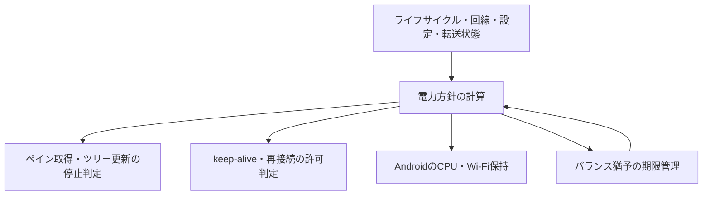

# Issue #128 バッテリー消費改善 実装計画

- 作成日: 2026-09-25
- 調査対象: `fix/issue-128-save-battery` / `e196f66`
- 状態: 実装済み、回帰テスト・修正後計測を実施中（2026-09-26）
- Issue: https://github.com/moezakura/mux-pod/issues/128
- 調査レポート: https://md-server.mox.run/d7288186-1835-45ea-8822-02663d1948c4/issue128-battery-investigation/

## 1. 目的と合意済み仕様

背景で画面取得が継続する不具合と不要な常時WakeLock保持を解消する。前面の入力応答性を維持し、接続維持と省電力の選択をユーザーに提供する。

設定画面の「接続と転送」に「バックグラウンド動作」を追加する。

| 設定項目 | 選択肢 | 初期値 |
|---|---|---|
| モバイル通信時（LTE・5G等） | 接続優先 / バランス / 省電力優先 | 省電力優先 |
| Wi-Fi・有線LAN時 | 接続優先 / バランス / 省電力優先 | バランス |
| 回線不明時 | 接続優先 / バランス / 省電力優先 | 省電力優先 |

| モード | 背景・転送なしでの契約 |
|---|---|
| 接続優先 | 接続維持に必要なkeep-aliveと電源保持を継続する。通信断時は既存のバックオフによる再接続を許す |
| バランス | 背景移行から一定時間は接続優先と同等。その後は省電力動作へ移る |
| 省電力優先 | CPU WakeLock・WiFi Lockの常時保持を解除する。OSによる切断を許容し、前面復帰時に確認・再接続する |

- 全モードで背景のペイン取得と定期ツリー更新を停止する。
- 前面の適応型ポーリング、描画頻度、入力ブーストは変更しない。
- 回線種別・設定の変更を実行中の方針に反映する。
- 転送中は必要な保持を優先し、終了後に選択モードへ戻す。
- 接続優先はOSや回線による切断まで防ぐ保証ではない。
- バランスの猶予は初期候補60秒。実機検証で評価し、確定値を記録する。今回、猶予秒数の設定UIは追加しない。

## 2. 根拠と検証の限界

| 所見 | 根拠 | 判断 |
|---|---|---|
| 背景でポーリングが復活する | `session_runtime.dart` のawait後の再予約が `isInBackground` を見ない。`session_lifecycle.dart` はタイマーのみキャンセル | コード上で成立する競合。最優先修正 |
| tmux・herdrとも停止失敗がある | 保存済み `home-trials-tmux.txt` は5/15、herdrは2/10 | 既存試験結果を再確認済み。今回の新規再現ではない |
| 画面OFFでもCPU WakeLockを保持 | `foreground_task_service.dart` の両lock設定がtrue。保存済みbatterystatsで30分保持 | ポーリング修正とは独立して対処 |
| keep-aliveが二重 | アプリの `SshKeepAlive` とdartssh2 2.22.5の既定10秒 | 使用中依存のソースで確認済み |
| 背景でも再接続し得る | `ssh_reconnect_policy.dart` の無制限リトライ、ネットワーク復帰からの直接再接続 | 省電力方針を再接続にも適用する必要がある |
| 回線種別の切替を通知できない | `network_monitor.dart` はonline/offlineだけを保持し、同じonlineなら通知しない | モバイル↔Wi-Fiを表す状態追加が必要 |
| 設定更新だけでは保持済みlockを変更できない | flutter_foreground_task 8.17.0のAndroid `API_UPDATE` は通知・taskのみ更新。lock再取得はサービス開始経路 | `updateService` の成功だけを解除の証拠にしない |

計測はエミュレーターであり、電池消費量の改善率は未確認。通信量は端末全体でありアプリ単独の値ではない。CPU suspendとDozeは区別し、WakeLock保持だけからDoze未移行の原因を断定しない。

既存証跡:

- `~/Documents/claude/.scratch/investigate/issue128-results/`
- `~/Documents/claude/.scratch/investigate/issue128-bench/`
- `~/Documents/claude/mux-pod/issue128-battery-investigation.md`

## 3. 設計案

### 3.1 方針の単一所有者

アプリ全体のライフサイクルを監視するコーディネーターを設ける。TerminalScreenだけに所有させず、設定画面・ファイルブラウザー表示中も同じ方針を適用する。

入力は「ライフサイクル、回線種別、保存設定、SSH接続状態、転送の実行状態」。純粋なポリシー計算と副作用の適用を分離する。

出力は「画面取得可否、keep-alive可否、自動再接続可否、CPU/Wi-Fi保持要否、猶予期限」。SSHと転送のProviderが相互にwatchし合う構造を避け、コーディネーターから必要な操作を注入する。

非同期の副作用は順序を管理し、世代番号等で古い完了結果の適用を防ぐ。開始・停止は冪等にし、失敗した適用を成功済みとして記録しない。SSH未接続での無意味な保持を避け、接続試行が必要な場合は試行時間に対応する所有関係を明示する。

### 3.2 モードの具体的な動作案

| 状態 | 画面取得 | keep-alive | 自動再接続 | 常時電源保持 |
|---|---|---|---|---|
| 前面 | 既存動作 | アプリ側1系統 | 許可 | 接続待機のためには不要 |
| 背景・接続優先 | 停止 | アプリ側1系統 | 許可 | 必要な保持を許可 |
| 背景・バランス猶予内 | 停止 | アプリ側1系統 | 許可 | 必要な保持を許可 |
| 背景・省電力／猶予後 | 停止 | 停止 | 前面復帰まで保留 | 解除 |
| 背景・転送中 | 停止 | 必要な接続監視を許可 | 既存転送の失敗契約を維持 | 転送に必要な期間のみ |

省電力移行時にSSHを意図的に切断しない。維持用の定期仕事を止め、接続が自然に失われることを許容する。前面復帰時は接続フラグだけで健全と判断せず、有効な応答またはタイムアウトを確認する。既存のsingle-flightを使い、復帰・ネットワーク通知・ポーリングの再接続を重複させない。

背景での切断は状態へ記録するが、省電力による再接続保留を「ネットワークなし」と表示しない。復帰時に残った再接続カウントダウンや古いエラー表示を整理する。

### 3.3 ポーリング停止の不変条件

- `isInBackground` とherdr障害等による `pollingSuspended` を別の停止理由として扱う。
- 開始、タイマー予約、実行直前、await後の再予約で停止条件を確認する。
- 世代を更新して、背景化→復帰後に古いpollが再予約しないようにする。
- `startPolling`、入力ブースト、再接続、リサイズ、CRUD完了からの再開にも同じ条件を適用する。
- ツリー更新の開始と実行にも停止条件を適用する。
- 背景移行時の進行中リクエストや一度限りのウィンドウサイズ復元は許容する。その完了後に定期仕事が再開しないことを保証する。
- 初期ライフサイクル状態と `detached` も扱い、inactive/hidden/pausedの連続通知で猶予を延長しない。

### 3.4 回線種別と猶予

既存online/offline APIを維持し、回線種別を含む状態と初期値を購読できる経路を追加する。購読開始前に初期イベントが失われないようにする。

`connectivity_plus` の接続インターフェース情報はSSHの実際の経路やインターネット到達性の保証ではない。以下を追加確認により確定した。

- モバイルとWi-Fiが同時に列挙される場合はWi-Fi設定を採用。
- VPNと下位回線が併記される場合は下位回線を使用。VPNだけ・unknown・その他は独立した「回線不明時」設定を適用（初期値は省電力優先）。
- EthernetはWi-Fi設定を使う。
- オフラインでは再接続を保留し、接続待機だけのlockは解除する。

バランスの期限は背景移行時点を起点とする。回線変更・設定変更・転送終了では60秒を再付与しない。復帰時に解除し、次の背景移行で新しい期限を作る。タイマーの実行がOSに遅延されても、次のイベントでは期限を評価して省電力へ移る。

### 3.5 keep-alive・再接続

- 鍵／パスワード認証の両SSHClient生成で、dartssh2側keep-aliveを無効化する案を採用し、アプリ側の既存切断検知を残す。
- 接続優先・前面・猶予内は、まず既存の5〜30秒の適応と失敗閾値を維持する。初回から別の固定間隔を加えない。
- `SshKeepAlive.stop()` 後に進行中probeが完了しても再予約・故障通知を復活させないよう、実行許可と接続世代を確認する。
- 再接続の予約、実行直前、ネットワーク復帰による直接実行を同じ許可条件で制御する。
- タイマー取消時には待機中Futureを完了させる。現在の `Completer` を未完了のまま残す経路を解消する。
- 背景省電力へ移行中に再接続が完了した場合も、現在の方針を適用してlockやpollingを再開させない。

### 3.6 Androidの電源保持

Foreground Serviceの通知と電源保持を別責務にする。既存の画面点灯設定 `keepScreenOn` はCPU WakeLockとは別として維持する。

まず既存プラグインで設定更新＋サービス再始動により、SSH・転送を中断せずlockを切り替えられるか限定検証する。Dartの成功戻り値に加え、Android側の実際のlock状態を確認する。通知の保持、Androidの背景サービス起動制限、連続切替、失敗時の状態も確認対象とする。

この経路が成立しない場合は、プラグインの自動lock取得をfalseに固定し、アプリ側の小さなAndroidブリッジで明示取得・解除する案へ進む。`MainActivity.kt` の既存MethodChannelとは責務を分け、Application context、engine切離し・切断時の解放、所有者の重複、失敗時の後始末を設計する。pub-cacheは編集しない。

WiFi LockはWi-Fi利用時のみを候補とし、必要性・効果を実機確認する。Android APIレベルによる扱いも実装時に公式資料と照合する。

バッテリー最適化除外の要求は、現在の「SSH接続時に常に要求」からモードに応じた扱いへ見直す。省電力利用者へ接続維持用の除外要求を自動表示しない。既存のOS設定をアプリ側で勝手に変更しない。

iOSではAndroidのlockを模倣せず、共通のpolling停止・設定・復帰処理を適用する。背景接続の持続時間はOS制約内に限定する。モードUIはユーザー確認によりiOSにも共通表示する。

### 3.7 転送の例外

ダウンロードだけでなく、通常ファイルアップロードと画像アップロードも対象とする。

- `download_provider.dart` / `file_transfer_provider.dart` / `image_transfer_provider.dart` の全経路を扱う。
- 実際の転送開始から終了処理まで保持を所有する。UIの進捗通知頻度ごとに電源設定を再適用しない。
- 並列転送やバッチは参照数または所有トークンで管理し、一件の完了で他の保持を解除しない。
- 完了・失敗・キャンセル・SSH切断・破棄の各終了経路で解放する。
- ファイル選択、衝突確認、Save-As待ちだけで無期限保持しない。事前スキャン等に必要な有限処理は個別に扱う。
- キャンセル要求と転送終了を区別し、実際の後始末が終わる前に保持を解放しない。
- SSH切断後の転送自動再開は追加しない。既存の失敗・キャンセル契約を維持する。

## 4. 実装タスクと対象

順序は依存関係を表す。実装はレビューできる単位で分ける。

| ID | 作業 | 主な対象 | 完了条件 |
|---|---|---|---|
| T1 | 決定的な競合再現テストとpolling修正 | `session_runtime.dart`, `session_poll.dart`, `session_lifecycle.dart`, `session_tree.dart`, `terminal_screen.dart` と関連再開経路 | 応答待ち中の背景化後に再予約なし。素早い復帰でも単一ループ |
| T2 | 回線状態・モード型・保存 | `network_monitor.dart`, `settings_state.dart`, `settings_provider.dart`, `settings_persistence.dart` | 3設定を独立保存。未保存・不正値は回線ごとの初期値。online間の回線変化を通知 |
| T3 | Androidのlock切替を限定実証 | `foreground_task_service.dart` と必要ならAndroidブリッジ | 既存サービス経路かブリッジかを証跡付きで確定。転送を切らず取得・解除可能 |
| T4 | 共通ポリシーとライフサイクル接続 | 新規background policy/controller/provider、`main.dart` 等のアプリルート | 純粋な状態遷移テスト。期限・設定変更・回線変更に即応。古い適用を防止 |
| T5 | keep-alive・再接続・電源保持を統合 | `ssh_keep_alive.dart`, `ssh_connector.dart`, `ssh_client.dart`, `ssh_provider.dart`, `ssh_reconnect_policy.dart`, `ssh_connection_orchestrator.dart`, `ssh_state.dart` | 省電力待機中の定期probe／自動retryなし。前面復帰時に接続検証 |
| T6 | 全転送経路の保持を統合 | 3転送Provider、必要なら転送サービス | 同時転送・中断・失敗でも保持漏れなし。終了後に現在の方針へ戻る |
| T7 | 設定UI・検索・翻訳 | `connection_section.dart`, 新規picker、設定検索switcher、`app_ja.arb`, `app_en.arb` | Wi-Fi／モバイル／回線不明それぞれ3択、説明、現在値、検索からの変更が機能 |
| T8 | 回帰検証・before/after記録 | 既存・追加テストと計測スクリプト | 下記受入条件を満たし、未検証範囲を明示 |

新しいDartパッケージの追加を前提としない。古い `docs/coding-conventions.md` はTypeScript時代の記述を含むため、現行Flutter/Riverpodの構造とAGENTS.mdを優先する。

## 5. 検証・受入条件

### 自動テスト

- Completerでpoll応答を止めた状態で背景化し、解放後に再予約されないことを確認する。
- inactive→hidden→paused、detached、背景起動、背景→前面→背景、dispose中の応答完了を確認する。
- 再接続／リサイズ／CRUD完了／入力ブーストから背景pollingが復活しない。
- 各モード×3回線分類、27通りの設定組合せ、猶予59/60/61秒、回線変更、同一通知、設定変更、オフライン復帰を検証する。
- keep-alive停止中のprobe完了、旧接続のprobe失敗、新接続開始の競合を検証する。
- 再接続タイマー取消でFutureが完了し、省電力中のネットワーク復帰で再接続しない。
- 全転送種別の正常／失敗／キャンセル／並列完了、猶予期限後の転送終了、UI確認待ちを検証する。
- 設定初期値、保存復元、不正値、日英表示、検索、スマートフォン・タブレットのレイアウトを検証する。
- 対象テストの後に `make analyze` と `make test` を実行する。

### エミュレーターと実機

1. 元の6条件（tmux/herdr × FG/BG画面ON/BG画面OFF）を同じ負荷・各30分で比較する。両バックエンドの修正後を個別に記録し、herdrの停止成功回をtmux修正後の代用にしない。
2. HOME退避の反復を各バックエンド30回以上行い、停止失敗0回を目標とする。進行中処理の終了後、背景の定期ペイン取得・ツリー取得が0件であることを確認する。
3. 省電力およびバランス期限後に、転送なしの常時CPU WakeLock／WiFi Lock保持がないことをdumpsysで確認する。
4. バランス期限内の復帰、期限後の復帰、通信断、ロック／解除、転送中の背景化、転送後の解除を確認する。
5. Wi-Fi↔モバイル切替は実機で検証し、両モードが異なる設定を含める。Wi-Fiテザリングは端末側のWi-Fiとして扱われる点を記録する。
6. Android実機で通常の画面OFFと強制Dozeを区別して試験する。除外設定の有無を記録し、接続維持がOS制約下で保証されないことも確認する。
7. 同一実機・負荷・輝度・回線・計測時間・ビルド種別でbefore/afterを測る。CPU時間、アプリ帰属の通信量、保持時間、電池消費、入力から表示までの遅延を記録する。エミュレーター値から電池改善率を推定しない。
8. 前面の静止／入力／連続出力で応答性を比較する。計測前に数値基準を記録し、悪化があれば背景対策と切り分ける。

計測記録にはSHA、端末・OS、回線、3つの保存設定、実効モード、負荷、期間、成功／失敗件数を含める。バランス60秒を変更した場合は理由を残す。

`make build-apk` はこのcheckoutで署名用 `android/app/upload-keystore.jks` 不在による失敗が既知。実装時は実行結果を確認し、コンパイル失敗と署名失敗を区別する。実証用profileビルドと配布用release署名を混同しない。

## 6. 実装前に確定する境界仕様と範囲

追加確認済み仕様（2026-09-26）:

- iOSにも3モード設定を表示する。OSによる背景実行制限を説明する。
- Wi-Fi＋モバイル同時検出、EthernetはWi-Fi設定を適用する。
- VPNと下位回線が判別できれば下位回線の設定を使う。
- 下位回線を判別できない場合は独立した「回線不明時」設定を使う。初期値はモバイルと同じ省電力優先。

バランス60秒は検証候補として扱い、計測後に確定する。Androidのlock実装方式はT3で技術的に選定し、既存機能を守れる通常の実装判断について追加承認は求めない。

今回の範囲外: 前面の固定低速化、tmux control mode等への通信方式変更、転送の自動再開、新規の秒数設定UI、無関係なSSHリファクタリング。

T1だけでIssue全体を完了扱いにしない。背景の不要な仕事と保持を解消し、モード・転送・復帰の検証を終えた上で、残る前面消費の調査結果と実機改善を報告する。

## 実装・検証の状況（2026-09-26）

設定、アプリ全体の電力方針、背景pollの競合防止、keep-alive／再接続制御、転送期間の保持、日英UIを実装した。追加調査で背景のカーソル点滅Timerも停止対象に含めた。Android lockは既存プラグインの設定更新＋サービス再始動を採用。バランスの初期実装値は60秒。自動テスト・profile APK・エミュレーターでの短時間検証と未検証項目は[検証結果](issue128-battery-validation.md)を参照。実機の電池消費改善と計画の長時間試験は完了扱いにしない。

追加の長時間検証: tmux/herdr × 前面/背景画面ON/背景画面OFFを各30分で測定し、全6条件と前面復帰確認が完了した。[30分検証結果](issue128-battery-30min-validation.md)を参照。実機電池消費、全モード比較、各30回の反復はこの検証に含まない。
